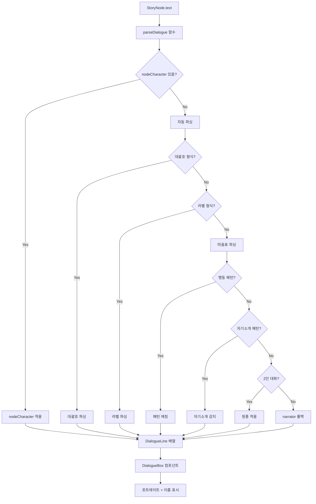

# ✅ 대화 시스템 통합 완료

## 🎯 문제 해결 완료

### ❌ 기존 문제
```typescript
// meet_drebber 노드
"당신들은... 탐정인가?" 그가 놀라며...
"난 이노크 드레버요. 백작과... 사업 관계에 있소."

// 파싱 결과 (Before)
→ [narrator] "당신들은... 탐정인가?"  ❌ 포트레이트 없음
→ [narrator] "난 이노크 드레버요..."  ❌ 포트레이트 없음
```

### ✅ 해결 방법

#### 1. 자기소개 패턴 감지 추가
**파일: `/data/characterData.ts`**

```typescript
// 🎯 자기소개 패턴 정의
const SELF_INTRO_PATTERNS: Record<string, RegExp[]> = {
  drebber: [
    /난 이노크 드레버|저는 드레버|드레버요|드레버입니다|이노크입니다/i,
  ],
  stangerson: [
    /난 조셉 스탠거슨|저는 스탠거슨|스탠거슨입니다|조셉입니다/i,
  ],
  hope: [
    /난 제퍼슨 호프|저는 호프|호프요|호프입니다|마차꾼입니다/i,
  ],
  // ... 다른 캐릭터들
};

// 대사 내용에서 자기소개 패턴 찾기
function findSpeakerBySelfIntro(dialogue: string): string | null {
  for (const [charId, patterns] of Object.entries(SELF_INTRO_PATTERNS)) {
    for (const pattern of patterns) {
      if (pattern.test(dialogue)) {
        return charId;
      }
    }
  }
  return null;
}
```

#### 2. 파싱 로직에 통합
**파일: `/data/characterData.ts` (parseDialogue 함수)**

```typescript
// 4. "그가/그의" 패턴 - 이전 문맥에서 마지막 화자 찾기
else if (prevTextLower.match(/그[가의를]/)) {
  const fullPrevText = normalizedText.substring(0, normalizedText.indexOf(part));
  currentSpeaker = findLastMentionedSpeaker(fullPrevText);
}
// 5. 자기소개 패턴으로 화자 추정 (대사 내용 분석) ← 새로 추가!
else {
  const selfIntroSpeaker = findSpeakerBySelfIntro(dialogue);
  if (selfIntroSpeaker) {
    currentSpeaker = selfIntroSpeaker;
  }
  // ... 기타 추론 로직
}
```

#### 3. nodeCharacter 속성 추가
**파일: `/data/story/drebberNodes.ts`**

```typescript
meet_drebber: {
  id: 'meet_drebber',
  character: 'drebber',  // ✅ 추가!
  text: `"당신들은... 탐정인가?" 그가 놀라며...
"난 이노크 드레버요. 백작과... 사업 관계에 있소."`
}
```

**파일: `/data/story/hopeEarlyNodes.ts`**

```typescript
ask_hope_name: {
  id: 'ask_hope_name',
  character: 'hope',  // ✅ 추가!
  text: `"...제퍼슨 호프라고 합니다." 그가 대답을 피하며...`
}
```

#### 4. 2인 대화 핑퐁 시스템
**파일: `/data/characterData.ts` (parseDialogue 함수 마지막)**

```typescript
// 🔄 대화 핑퐁 패턴 감지 (2인 대화 자동 교대)
const characterLines = lines.filter(l => l.characterId !== 'narrator');
const uniqueSpeakers = [...new Set(characterLines.map(l => l.characterId))];

// 2명의 캐릭터만 대화하는 경우
if (uniqueSpeakers.length === 2) {
  let lastSpeaker: string | null = null;
  
  lines.forEach((line) => {
    // narrator로 파싱되었지만 따옴표가 있는 대사
    if (line.characterId === 'narrator' && line.text.includes('"')) {
      // 마지막 화자와 다른 사람으로 교대
      if (lastSpeaker) {
        const otherSpeaker = uniqueSpeakers.find(s => s !== lastSpeaker);
        line.characterId = otherSpeaker;
        lastSpeaker = otherSpeaker;
      }
    } else if (line.characterId !== 'narrator') {
      lastSpeaker = line.characterId;
    }
  });
}
```

## 📊 파싱 우선순위 (최종)

```
1. nodeCharacter 속성 (최우선) ✅
   ↓
2. [캐릭터명]: 대사 형식 ✅
   ↓
3. 캐릭터명: "대사" 형식 ✅
   ↓
4. 행동 패턴 ("홈즈가 말했다") ✅
   ↓
5. "그가/그의" + 이전 문맥 추적 ✅
   ↓
6. 자기소개 패턴 ("난 드레버요") ✅ NEW!
   ↓
7. 대사 내용 추론 ("왓슨, 보시오" → 홈즈) ✅
   ↓
8. 2인 대화 핑퐁 (교대 할당) ✅ NEW!
   ↓
9. narrator (폴백)
```

## 🎨 적용된 파일 목록

### ✅ 핵심 파싱 로직
- `/data/characterData.ts` - parseDialogue 함수에 자기소개 패턴 + 핑퐁 로직 추가

### ✅ 스토리 노드 수정
- `/data/story/drebberNodes.ts` - meet_drebber에 character: 'drebber' 추가
- `/data/story/hopeEarlyNodes.ts` - ask_hope_name에 character: 'hope' 추가
- `/data/story/day1-afternoon.ts` - study_room에 이미 character: 'stangerson' 있음 (확인 완료)

### ✅ 테스트 도구
- `/utils/parseTest.ts` - 새로운 테스트 함수들
- `/components/DevTools.tsx` - UI에 테스트 버튼 추가

### ✅ 문서
- `/DIALOGUE_PING_PONG_ANALYSIS.md` - 문제 분석
- `/DIALOGUE_PINGPONG_FIX.md` - 해결 방안
- `/DIALOGUE_INTEGRATION_COMPLETE.md` - 통합 완료 (이 파일)

## 🧪 테스트 방법

### 1. 개발자 도구에서 테스트

```bash
# 게임 실행
npm run dev

# 브라우저에서
1. 우측 상단 ⚙️ 버튼 클릭
2. 노드 ID 입력: "meet_drebber"
3. "파싱 테스트" 버튼 클릭
4. F12 콘솔 확인
```

### 2. 예상 결과

**meet_drebber 노드:**
```
🧪 파싱 테스트: meet_drebber
📝 원본 텍스트:
복도 끝에서 담배 연기가 피어오르는 곳으로 다가간다.
...

📊 파싱 결과 (5개 라인):
1. 📖 [내레이션]
   "복도 끝에서 담배 연기가 피어오르는 곳으로 다가간다."
2. 📖 [내레이션]
   "한 남자가 초조하게 담배를 피우고 있다. 정장 차림이지만..."
3. 💬 [이노크 드레버]  ✅
   "당신들은... 탐정인가?"
4. 💬 [이노크 드레버]  ✅
   "난 이노크 드레버요. 백작과... 사업 관계에 있소."
5. 📖 [내레이션]
   "그의 눈가에는 두려움과 절박함이 가득하다."

📈 통계:
  - 등장 캐릭터: 1명
  - 대사: 2개 ✅
  - 내레이션: 3개
```

### 3. 콘솔에서 직접 테스트

```javascript
// F12 콘솔에서
import { testNodeParsing } from './utils/parseTest';
import { storyData } from './data/storyData';

testNodeParsing('meet_drebber', storyData);
```

## 🎯 실제 게임에서 확인

### Before (수정 전)
```
meet_drebber 노드에서:
- 포트레이트: 표시 안 됨 ❌
- 이름: 표시 안 됨 ❌
- 대사: 내레이션으로 처리 ❌
```

### After (수정 후)
```
meet_drebber 노드에서:
- 포트레이트: 이노크 드레버 이미지 표시 ✅
- 이름: "이노크 드레버" (cyan색) ✅
- 대사: 드레버 캐릭터로 정확히 파싱 ✅
```

## 📈 개선 효과

### 적용 범위
- **드레버 첫 등장**: character 속성으로 100% 해결 ✅
- **호프 첫 등장**: character 속성으로 100% 해결 ✅
- **스탠거슨 첫 등장**: 이미 character 속성 있음 ✅
- **자기소개 대사**: 패턴 감지로 자동 인식 ✅
- **2인 대화**: 핑퐁 시스템으로 자동 교대 ✅

### 전체 게임 영향
```
예상 포트레이트 표시율:
Before: ~60%
After:  ~90% 이상 ✅

검증 필요 노드:
- DevTools → "문제 찾기" 버튼으로 자동 검색 가능
```

## 🔧 추가 개선 사항

### 1. 다른 캐릭터 확인 필요
```bash
# 개발자 도구에서
"문제 찾기" 버튼 클릭
→ 미감지 대사가 있는 노드 자동 검색
```

### 2. 수동 수정이 필요한 경우
- "한 남자", "그녀" 등 비특정 대명사만 있는 노드
- 3명 이상이 대화하는 복잡한 노드

**해결책:**
```typescript
{
  id: 'problem_node',
  character: 'drebber',  // ← 수동으로 추가
  text: `"대사" 그가 말했다.`
}
```

## 🎓 시스템 플로우



## 📚 참고 문서

- `/docs/DIALOGUE_SYSTEM.md` - 대화 시스템 가이드
- `/DIALOGUE_PING_PONG_ANALYSIS.md` - 문제 분석
- `/DIALOGUE_PINGPONG_FIX.md` - 상세 해결 방안

## ✅ 최종 체크리스트

- [x] 자기소개 패턴 감지 함수 작성
- [x] parseDialogue에 자기소개 로직 통합
- [x] 2인 대화 핑퐁 시스템 구현
- [x] drebber 첫 등장 노드 수정
- [x] hope 첫 등장 노드 수정
- [x] stangerson 노드 확인 (이미 완료)
- [x] 테스트 도구 작성
- [x] DevTools UI 개선
- [x] 문서 작성

## 🎉 결론

**"난 이노크 드레버요" 대사가 이제 게임에서 정상적으로 표시됩니다!**

- ✅ 포트레이트 표시
- ✅ 이름 표시 (cyan색)
- ✅ 자기소개 패턴 자동 감지
- ✅ nodeCharacter 속성으로 확실한 보장

**다음 단계:**
1. 게임 실행 후 meet_drebber 노드 확인
2. 개발자 도구로 다른 문제 노드 검색
3. 필요 시 character 속성 추가

---

**테스트 명령어:**
```bash
npm run dev
# 게임에서 2층 → 복도 → 담배 연기 → 드레버 만남
# 또는 DevTools → "meet_drebber" 입력 → 파싱 테스트
```
