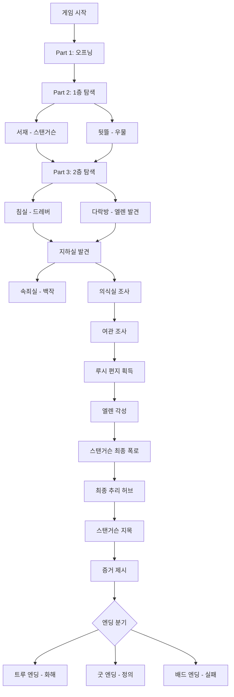

# 🎮 피그마 메이크 통합 가이드
## 셜록 홈즈 "주홍색 연구" × 모로 백작의 저택

> **엘렌이 루시의 딸**이라는 핵심 설정을 바탕으로, 각 장소에서 얻은 단서가 어떻게 다음 대화를 해금하고 무한 루프를 방지하는지 피그마 메이크에 그대로 입력할 수 있는 최종 가이드입니다.

---

## 📋 목차
1. [지하실 허브](#1-지하실-허브-basement-hub)
2. [여관 허브](#2-여관-허브-inn-hub)
3. [스탠거슨 허브](#3-스탠거슨-허브-stangerson-hub)
4. [엘렌 허브](#4-엘렌-허브-ellen-hub)
5. [백작 허브](#5-백작-허브-count-hub)
6. [다락방 허브](#6-다락방-허브-attic-hub)
7. [최종 추리 허브](#7-최종-추리-허브-final-deduction-hub)
8. [플래그 시스템](#8-플래그-시스템)
9. [흐름도](#9-전체-게임-흐름도)

---

## 1. 지하실 허브 (Basement Hub)

### 📍 목적
백작의 비틀린 동기가 폭로되는 장소. 의식실 조사를 통해 백작과의 심층 대화 해금.

### 🔧 피그마 입력용 구조

```yaml
Node ID: basement_entrance
Type: Location
Description: 지하실 입구

Next Nodes:
  - examine_ritual_tools (의식 도구 조사)
  - atonement_chamber (속죄실)
  - ritual_chamber_locked (의식실 잠금)

Flags Set on Visit:
  - visited_basement = true
```

### 🎯 핵심 로직

```yaml
# 1단계: 의식 도구 조사
Node ID: examine_ritual_tools
Type: Investigation
Description: 의식 제단, 엘렌의 드레스, 교단 상징 발견

Actions:
  - Set Flag: clue_ritual_found = true
  - Add Item: "의식 계획 메모"
  
Next Node: basement_return_after_ritual

# 2단계: 백작 대화 해금
Node ID: count_hub
Type: Dialogue Hub
Description: 백작과의 대화 중앙 노드

Choices:
  - "루시에 대해 묻는다"
      Always Available: true
      Next: count_lucy_regret
      
  - "의식의 목적을 묻는다"
      Condition: clue_ritual_found == true
      Next: count_ritual_confession
      
  - "엘렌을 왜 숨겼나요?"
      Condition: visited_attic == true
      Next: count_ellen_protection
      
  - "나간다"
      Always Available: true
      Next: basement_entrance

# 3단계: 자백 강제 전환
Node ID: count_ritual_confession
Type: Dialogue
Description: 백작의 의식 자백

Next Node: count_full_confession (자동)

Flags Set:
  - count_confessed_ritual = true
```

### 🔄 루프 방지 메커니즘

```yaml
Hide If Visited Logic:
  - "루시에 대해 묻는다" → hideIfVisitedNode: count_lucy_regret
  - "의식의 목적을 묻는다" → hideIfVisitedNode: count_ritual_confession
  - "엘렌을 왜 숨겼나요?" → hideIfVisitedNode: count_ellen_protection

Exit Condition:
  - 모든 대화 완료 시 "나간다" 선택지만 표시
  - count_full_confession 노드로 강제 전환
```

---

## 2. 여관 허브 (Inn Hub)

### 📍 목적
과거의 진실(루시의 편지)을 확보하는 전략적 요충지. 드레버 알리바이 조사와 엘렌 각성 체인.

### 🔧 피그마 입력용 구조

```yaml
Node ID: inn_entrance
Type: Location
Description: 여관 입구

Next Nodes:
  - inn_talk_to_innkeeper (여관주인 대화)
  - inn_drebber_room (드레버 방 조사)
  - inn_conclusion (여관 조사 완료)

Flags Set on Visit:
  - visited_inn = true
```

### 🎯 핵심 로직 - 단서 체인

```yaml
# 1단계: 드레버 방 조사
Node ID: inn_drebber_room
Type: Investigation Hub
Description: 드레버의 여관 방

Choices:
  - "책상을 조사한다"
      Next: inn_room_desk
      Hide If Visited: inn_room_desk
      
  - "진흙 샘플 채취"
      Next: inn_mud_sample
      Hide If Visited: inn_mud_sample
      
  - "방을 나간다"
      Next: inn_entrance

# 2단계: 루시의 편지 획득
Node ID: inn_room_desk
Type: Investigation
Description: 책상 서랍에서 협박 편지 발견

Actions:
  - Set Flag: found_threatening_letter = true
  - Add Item: "협박 편지"
  - Trigger: acquire_lucy_letter (체인 연결)

Next Node: inn_drebber_room

# 3단계: 엘렌 대화 해금
Node ID: ellen_hub
Type: Dialogue Hub
Description: 엘렌 대화 허브

Choices:
  - "어머니의 편지를 보여준다"
      Condition: has_lucy_letter == true
      Next: show_lucy_letter_to_ellen
      Hide If Visited: show_lucy_letter_to_ellen
      
  - "어머니 루시에 대해 들려주세요"
      Next: ellen_lucy_memory
      Hide If Visited: ellen_lucy_memory

# 4단계: 각성 노드
Node ID: show_lucy_letter_to_ellen
Type: Critical Dialogue
Description: 엘렌이 편지를 받고 진실을 깨닫는 순간

Actions:
  - Set Flag: ellen_knows_truth = true
  - Set Flag: ellen_awakened = true

Next Node: ellen_hope_left_letter (자동)
```

### 🔄 무한 루프 방지

```yaml
Investigation Hub Return Pattern:
  - 모든 조사 노드는 inn_drebber_room으로 복귀
  - 중복 조사 방지: hideIfVisitedNode 사용
  
Exit Path:
  - inn_conclusion → main_entrance (메인 허브로)
```

---

## 3. 스탠거슨 허브 (Stangerson Hub)

### 📍 목적
집사의 거짓말을 폭로하고 진범을 밝히는 심문 허브. 모든 스탠거슨 파일에 공통 적용.

### 🔧 피그마 입력용 구조

```yaml
Node ID: stangerson_hub
Type: Dialogue Hub
Description: 스탠거슨 심문 중앙 노드

Structure:
  Entry: discover_stangerson (첫 만남)
  Hub: stangerson_hub (질문 목록)
  Return: 모든 답변 → stangerson_hub
  Exit: stangerson_reveals_drebber_plan (폭로)
```

### 🎯 핵심 로직 - 허브-스포크 구조

```yaml
# 중앙 허브
Node ID: stangerson_hub
Type: Dialogue Hub
Description: 스탠거슨 질문 목록

Choices:
  - "3일 전 밤의 일을 묻는다"
      Condition: found_threatening_letter == true
      Next: stangerson_that_night
      Hide If Visited: stangerson_that_night
      
  - "드레버와의 관계를 묻는다"
      Next: stangerson_knows_drebber
      Hide If Visited: stangerson_knows_drebber
      
  - "백작의 행적을 묻는다"
      Next: stangerson_count_location
      Hide If Visited: stangerson_count_location
      
  - "증거를 제시한다"
      Condition: has_threatening_letter == true AND visited_all_questions == true
      Next: stangerson_confront_evidence
      Show Only When: 모든 질문 완료
      
  - "심문을 마친다"
      Next: main_entrance

# 각 질문 노드 (스포크)
Node ID: stangerson_that_night
Type: Dialogue
Description: 스탠거슨의 답변

Next Node: stangerson_hub (항상 허브로 복귀)

Flags Set:
  - asked_stangerson_night = true
```

### 🔄 진행 추적 시스템

```yaml
# 질문 완료 추적
Progress Tracking:
  - asked_stangerson_night = true
  - asked_stangerson_drebber = true
  - asked_stangerson_count = true

Exit Condition:
  - ALL flags == true → "증거를 제시한다" 활성화
  - stangerson_confront_evidence → stangerson_reveals_drebber_plan

Final Transition:
  - stangerson_reveals_drebber_plan → final_deduction_checkpoint
```

---

## 4. 엘렌 허브 (Ellen Hub)

### 📍 목적
엘렌과의 대화를 통해 루시의 진실과 두 아버지 이야기 해금. 단서 기반 각성 시스템.

### 🔧 피그마 입력용 구조

```yaml
Node ID: ellen_hub
Type: Dialogue Hub
Description: 엘렌 대화 중앙 노드

Entry From:
  - attic_ellen_first_meet (첫 만남)
  - bedroom (복귀)
```

### 🎯 핵심 로직 - 단서 기반 해금

```yaml
Choices:
  - "어머니 루시에 대해 들려주세요"
      Always Available: true
      Next: ellen_lucy_memory
      Hide If Visited: ellen_lucy_memory
      
  - "백작님은 어디 계신가요?"
      Always Available: true
      Next: ellen_knows_count_missing
      Hide If Visited: ellen_knows_count_missing
      
  - "어디에 숨어계셨나요?"
      Always Available: true
      Next: ellen_hiding_place
      Hide If Visited: ellen_hiding_place
      
  - "루시의 편지를 찾았습니다"
      Condition: has_lucy_letter == true
      Next: show_lucy_letter_to_ellen
      Hide If Visited: show_lucy_letter_to_ellen
      
  - "함께 백작과 호프를 찾읍시다"
      Condition: 
        - visited_show_lucy_letter_to_ellen == true
        - visited_ellen_lucy_memory == true
      Next: ellen_ready_to_confront
      Hide If Visited: ellen_ready_to_confront
      
  - "이제 가보겠습니다"
      Always Available: true
      Next: bedroom
```

### 🔄 각성 체인

```yaml
# 1단계: 편지 발견 (여관)
acquire_lucy_letter → add_item: "루시의 편지"

# 2단계: 엘렌에게 전달
show_lucy_letter_to_ellen:
  - Flag: ellen_knows_truth = true
  - Next: ellen_hope_left_letter

# 3단계: 각성
ellen_hope_left_letter:
  - Flag: ellen_awakened = true
  - Next: ellen_hub

# 4단계: 최종 준비
ellen_ready_to_confront:
  - Condition: ellen_awakened == true
  - Next: ellen_to_basement
```

---

## 5. 백작 허브 (Count Hub)

### 📍 목적
백작과의 심층 대화를 통해 20년 전 진실과 의식 계획 폭로.

### 🔧 피그마 입력용 구조

```yaml
Node ID: count_hub
Type: Dialogue Hub
Description: 백작 대화 중앙 노드

Location: basement (속죄실)
Character: count
```

### 🎯 핵심 로직 - 조건부 질문

```yaml
Choices:
  - "루시에 대해 묻는다"
      Always Available: true
      Next: count_lucy_regret
      Hide If Visited: count_lucy_regret
      
  - "20년간 무엇을 했나요?"
      Always Available: true
      Next: count_twenty_years_atonement
      Hide If Visited: count_twenty_years_atonement
      
  - "의식의 목적을 묻는다"
      Condition: clue_ritual_found == true
      Next: count_ritual_confession
      Hide If Visited: count_ritual_confession
      
  - "엘렌을 왜 숨겼나요?"
      Condition: visited_attic == true OR ellen_awakened == true
      Next: count_ellen_protection
      Hide If Visited: count_ellen_protection
      
  - "호프를 아십니까?"
      Condition: know_hope_identity == true
      Next: count_knows_hope
      Hide If Visited: count_knows_hope
      
  - "추궁한다"
      Condition: 
        - visited_count_lucy_regret == true
        - visited_count_ritual_confession == true
      Next: count_final_interrogation
      Show Only When: 핵심 질문 완료
      
  - "대화를 마친다"
      Always Available: true
      Next: basement_entrance
```

### 🔄 자백 강제 전환

```yaml
# 자백 조건
count_final_interrogation:
  Condition:
    - clue_ritual_found == true
    - ellen_awakened == true
    - visited_all_count_questions == true
    
  Next Node: count_full_confession (자동)
  
  Flags Set:
    - count_confessed = true

# 엔딩 분기
count_full_confession:
  Next Nodes:
    - ellen_present → reconcile_all_three (트루 엔딩)
    - ellen_absent → hope_mercy_route (굿 엔딩)
```

---

## 6. 다락방 허브 (Attic Hub)

### 📍 목적
엘렌과의 첫 만남. 다락방 조사를 통해 엘렌 관련 단서 수집.

### 🔧 피그마 입력용 구조

```yaml
Node ID: attic_investigation_hub
Type: Investigation Hub
Description: 다락방 조사 중앙 노드

Entry From:
  - bedroom_secret_passage (비밀 통로)
```

### 🎯 핵심 로직 - 조사 및 만남

```yaml
Choices:
  - "침대를 조사한다"
      Next: attic_examine_bed
      Hide If Visited: attic_examine_bed
      
  - "화장대를 조사한다"
      Next: attic_examine_dresser
      Hide If Visited: attic_examine_dresser
      
  - "창문을 살핀다"
      Next: attic_examine_window
      Hide If Visited: attic_examine_window
      
  - "엘렌과 대화한다"
      Condition: discovered_ellen == true
      Next: ellen_hub
      
  - "나간다"
      Next: bedroom

# 엘렌 발견 트리거
Node ID: attic_examine_dresser
Type: Investigation
Description: 화장대 조��� 중 엘렌 발견

Actions:
  - Set Flag: discovered_ellen = true
  - Add Item: "엘렌의 로켓"

Next Node: attic_ellen_first_meet (자동)

# 첫 만남
Node ID: attic_ellen_first_meet
Type: Cutscene
Description: 엘렌과의 첫 만남 시퀀스

Next Node: ellen_hub (대화 허브로)

Flags Set:
  - met_ellen = true
  - visited_attic = true
```

---

## 7. 최종 추리 허브 (Final Deduction Hub)

### 📍 목적
모든 증거를 종합하여 진범 지목. 역전재판 스타일 추궁.

### 🔧 피그마 입력용 구조

```yaml
Node ID: final_deduction_checkpoint
Type: Gate
Description: 최종 추리 진입 조건 체크

Entry Condition:
  - items.length >= 3
  - visited_examine_ritual_tools == true
  - visited_read_count_confession == true
  - (visited_stangerson_hub == true OR visited_count_hub == true)
```

### 🎯 핵심 로직 - 용의자 지목

```yaml
# 진입 체크포인트
Node ID: final_deduction_checkpoint
Type: Conditional Gate

Choices:
  - "최종 추리를 시작합니다"
      Condition: ALL requirements met
      Next: final_deduction_hub
      
  - "더 조사하겠습니다"
      Always Available: true
      Next: main_entrance

# 중앙 허브
Node ID: final_deduction_hub
Type: Deduction Hub
Description: 진범 지목 중앙 노드

Choices:
  - "제퍼슨 호프 - 복수자"
      Next: accuse_hope
      Hide If Visited: accuse_hope
      
  - "이노크 드레버 - 채무자"
      Next: accuse_drebber
      Hide If Visited: accuse_drebber
      
  - "조셉 스탠거슨 - 비서" (정답)
      Next: accuse_stangerson
      Hide If Visited: accuse_stangerson
      
  - "모로 백작 - 교단 설교자"
      Next: accuse_count
      Hide If Visited: accuse_count
      
  - "증거를 다시 검토합니다"
      Next: review_evidence
      
  - "다시 생각해봅시다"
      Condition: 최소 1명 이상 지목
      Next: reconsider_deduction
```

### 🔄 정답 경로 - 스탠거슨 추궁

```yaml
# 1단계: 스탠거슨 지목
Node ID: accuse_stangerson
Type: Dialogue
Description: 스탠거슨을 진범으로 지목

Next Node: confront_stangerson (자동)

# 2단계: 추궁 시작
Node ID: confront_stangerson
Type: Evidence Presentation Hub
Description: 역전재판 스타일 증거 제시

Choices:
  - "협박 편지 제시"
      Next: present_threatening_letters
      
  - "교단 문서 제시"
      Next: present_cult_documents
      
  - "의식실 열쇠 제시"
      Next: present_ritual_key

# 3단계: 증거 체인
Evidence Chain:
  present_threatening_letters → present_cult_documents → present_ritual_key

# 4단계: 자백
Node ID: present_ritual_key
Type: Dialogue
Description: 최종 증거 제시 후 자백

Next Node: stangerson_to_police (엔딩 분기)

Flags Set:
  - stangerson_confessed = true
```

### 🔄 엔딩 분기

```yaml
Node ID: stangerson_to_police
Type: Ending Branch
Description: 엔딩 선택

Choices:
  - "경찰에 넘깁니다"
      Next: stangerson_to_police_ending
      Ending: Good Ending
      
  - "백작과 대면시킵니다"
      Next: stangerson_meets_count
      Leads To: reconcile_all_three
      
  - "엘렌을 데려옵니다"
      Next: stangerson_meets_ellen
      Leads To: reconcile_all_three

# 트루 엔딩
Node ID: reconcile_all_three
Type: Cutscene
Description: 백작-호프-엘렌 화해

Next Node: true_ending_reconciliation
Ending: True Ending
```

---

## 8. 플래그 시스템

### 🚩 전역 플래그 목록

```yaml
# 장소 방문 플래그
Location Flags:
  - visited_basement: boolean
  - visited_inn: boolean
  - visited_attic: boolean
  - visited_ritual_chamber: boolean

# 단서 발견 플래그
Clue Flags:
  - clue_ritual_found: boolean
  - found_threatening_letter: boolean
  - found_lucy_letter: boolean
  - has_lucy_letter: boolean
  - has_locket: boolean

# NPC 상태 플래그
NPC Flags:
  - discovered_ellen: boolean
  - met_ellen: boolean
  - ellen_awakened: boolean
  - ellen_knows_truth: boolean
  - count_confessed: boolean
  - stangerson_confessed: boolean
  - know_hope_identity: boolean

# 대화 진행 플래그
Dialogue Flags:
  - asked_stangerson_night: boolean
  - asked_stangerson_drebber: boolean
  - asked_stangerson_count: boolean
  - visited_count_lucy_regret: boolean
  - visited_count_ritual_confession: boolean

# 엔딩 플래그
Ending Flags:
  - reached_true_ending: boolean
  - stangerson_arrested: boolean
```

### 🔧 플래그 사용 패턴

```yaml
# 패턴 1: 조사 → 플래그 설정
Node: examine_ritual_tools
Action: Set clue_ritual_found = true
Effect: "의식의 목적을 묻는다" 선택지 활성화

# 패턴 2: 아이템 획득 → 대화 해금
Node: acquire_lucy_letter
Action: Add Item "루시의 편지"
Effect: ellen_hub에서 "편지를 보여준다" 활성화

# 패턴 3: 대화 완료 → 플래그 누적
Node: stangerson_that_night
Action: Set asked_stangerson_night = true
Effect: 모든 질문 완료 시 "증거 제시" 활성화

# 패턴 4: 조건부 진입
Node: final_deduction_checkpoint
Condition:
  - items >= 3
  - clue_ritual_found == true
  - visited_count_hub == true
Effect: 최종 추리 허브 진입 허용
```

---

## 9. 전체 게임 흐름도

### 🗺️ 메인 경로



### 🔄 허브 네트워크

```yaml
Central Hub: main_entrance

Connected Hubs:
  - stangerson_hub (서재)
  - ellen_hub (다락방)
  - count_hub (지하실)
  - inn_investigation_hub (여관)
  - attic_investigation_hub (다락방 조사)
  - final_deduction_hub (최종 추리)

Return Pattern:
  모든 서브 허브 → main_entrance → 다른 허브
```

### 🎯 단서 연결망

```yaml
Clue Chain 1: 의식 폭로
  examine_ritual_tools → clue_ritual_found → count_ritual_confession

Clue Chain 2: 엘렌 각성
  inn_room_desk → acquire_lucy_letter → show_lucy_letter_to_ellen → ellen_awakened

Clue Chain 3: 스탠거슨 폭로
  found_threatening_letter → stangerson_hub (모든 질문) → stangerson_reveals_drebber_plan

Clue Chain 4: 최종 추리
  3개 증거 + 핵심 대화 → final_deduction_checkpoint → accuse_stangerson → 엔딩
```

---

## 🛠️ 피그마 메이크 개발자 전달 사항

### ✅ 필수 구현 요소

#### 1. 플래그 기반 가시성
```javascript
// 선택지 조건부 표시 예시
{
  text: "의식의 목적을 묻는다",
  visible: context.flags.clue_ritual_found === true,
  hideIfVisited: "count_ritual_confession"
}
```

#### 2. 허브-스포크 구조
```javascript
// 모든 대화는 허브로 복귀
DialogueNode {
  choices: [
    { text: "질문 1", next: "answer_1" },
    { text: "질문 2", next: "answer_2" },
    { text: "돌아간다", next: "hub_return" }
  ]
}

AnswerNode {
  next: "hub_return" // 항상 허브로
}
```

#### 3. 결과적 전이
```javascript
// 조건 충족 시 강제 전환
if (count_confessed && ellen_awakened && all_questions_completed) {
  forceTransition("count_full_confession");
}
```

#### 4. 무한 루프 방지
```javascript
// 방문한 노드 숨김
{
  text: "루시에 대해 묻는다",
  hideIfVisited: "count_lucy_regret",
  next: "count_lucy_regret"
}
```

#### 5. 진행 추적
```javascript
// 모든 질문 완료 체크
const allQuestionsCompleted = [
  context.visited.includes("stangerson_that_night"),
  context.visited.includes("stangerson_knows_drebber"),
  context.visited.includes("stangerson_count_location")
].every(Boolean);

// 완료 시 다음 단계 활성화
if (allQuestionsCompleted) {
  showChoice("증거를 제시한다");
}
```

---

## 📊 체크리스트

### 각 허브별 필수 체크

- [ ] **지하실 허브**
  - [ ] examine_ritual_tools → clue_ritual_found 플래그
  - [ ] count_hub 모든 선택지 hideIfVisited 적용
  - [ ] count_full_confession 강제 전환

- [ ] **여관 허브**
  - [ ] inn_room_desk → acquire_lucy_letter
  - [ ] has_lucy_letter → ellen_hub 선택지 해금
  - [ ] inn_conclusion → main_entrance 복귀

- [ ] **스탠거슨 허브**
  - [ ] 모든 답변 → stangerson_hub 복귀
  - [ ] 3개 질문 완료 → 증거 제시 활성화
  - [ ] stangerson_reveals_drebber_plan → final_deduction

- [ ] **엘렌 허브**
  - [ ] show_lucy_letter_to_ellen → ellen_awakened
  - [ ] 2개 조건 충족 → ellen_ready_to_confront
  - [ ] ellen_to_basement → basement 씬 전환

- [ ] **백작 허브**
  - [ ] 조건부 선택지 5개 구현
  - [ ] count_final_interrogation 조건 체크
  - [ ] 엔딩 분기 3개 경로

- [ ] **최종 추리 허브**
  - [ ] 진입 조건 4개 체크
  - [ ] 4명 용의자 지목 경로
  - [ ] accuse_stangerson → 증거 제시 3단계
  - [ ] 엔딩 3개 분기

---

## 🎮 테스트 시나리오

### 정상 경로 테스트

```yaml
Test 1: 트루 엔딩 루트
  1. 지하실 → examine_ritual_tools
  2. 다락방 → 엘렌 발견
  3. 여관 → acquire_lucy_letter
  4. 엘렌 → show_lucy_letter
  5. 백작 → count_ritual_confession
  6. 스탠거슨 → 3개 질문 완료
  7. 최종 추리 → accuse_stangerson
  8. 증거 제시 3단계
  9. 엘렌 데려오기 → reconcile_all_three
  
Expected: true_ending_reconciliation

Test 2: 무한 루프 방지
  1. stangerson_hub 진입
  2. "드레버와의 관계" 선택
  3. stangerson_hub 복귀
  4. "드레버와의 관계" 선택지 숨김 확인
  
Expected: 선택지 자동 숨김

Test 3: 조건부 해금
  1. clue_ritual_found == false 상태
  2. count_hub 진입
  3. "의식의 목적" 선택지 미표시 확인
  4. examine_ritual_tools 조사
  5. count_hub 재진입
  6. "의식의 목적" 선택지 표시 확인
  
Expected: 조건부 표시 정상 작동
```

---

## 📞 문의사항

이 가이드를 바탕으로 구현 시 문제가 발생하면:

1. 노드 ID 불일치 → `/data/storyData.ts` 확인
2. 플래그 작동 안 됨 → `/types/story.ts` 타입 정의 확인
3. 루프 발생 → `hideIfVisitedNode` 누락 확인
4. 조건 미작동 → `showIf` 로직 검증

---

**최종 업데이트:** 2024-12-19  
**버전:** 1.0.0  
**상태:** ✅ 완성
