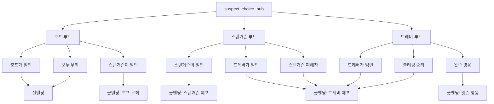

# 🆓 자유 선택 시스템 - 누구든 범인이 될 수 있다

## ✅ 완전한 자유도 구현 완료!

이제 **플레이어의 선택에 따라** 호프, 스탠거슨, 드레버 **누구든 범인이 될 수 있습니다!**

---

## 🎯 핵심 변경사항

### ❌ 이전 문제점
```
- 호프 루트 → 무조건 호프가 범인
- 스탠거슨 루트 → 무조건 스탠거슨이 범인
- 드레버 루트 → 무조건 드레버가 범인
- 진엔딩으로 강제됨
```

### ✅ 현재 시스템
```
- 호프 루트 → 호프가 범인일 수도, 아닐 수도 있음
- 스탠거슨 루트 → 스탠거슨이 범인일 수도, 무죄일 수도 있음
- 드레버 루트 → 드레버가 진짜 범인일 수도 있음
- 각 선택지마다 다양한 엔딩으로 분기
```

---

## 🎭 진범 가능성

### 🔴 호프 루트 (4가지 가능성)

#### 1️⃣ **호프가 진짜 범인** (진엔딩)
```
hope_route_start
→ 💬 "호프, 루시는 당신의 복수를 원하지 않을 것입니다"
→ hope_persuade_mercy
→ 🌟 true_ending_mercy
```
**결과**: 호프가 복수를 포기하고 백작을 용서. 모두 구원받음.

#### 2️⃣ **호프가 무죄, 스탠거슨이 진범** (굿엔딩)
```
hope_route_start
→ 🔍 "잠깐... 호프, 당신이 진짜 범인이 맞습니까?"
→ hope_doubt_culprit
→ hope_reveal_real_culprit (스탠거슨 등장!)
→ 💬 "호프는 무죄입니다. 당신이 진범이군요."
→ hope_route_accuse_stangerson
→ ✅ good_ending_hope_innocent
```
**결과**: 호프는 무죄로 밝혀지고, 스탠거슨이 체포됨.

#### 3️⃣ **호프도 무죄, 스탠거슨도 무죄, 함께 구함** (진엔딩 변형)
```
hope_route_start
→ 🔍 "잠깐... 호프, 당신이 진짜 범인이 맞습니까?"
→ hope_reveal_real_culprit
→ ⚔️ [스탠거슨에게 달려든다]
→ hope_route_save_all
→ 🌟 true_ending_mercy
```
**결과**: 호프가 스탠거슨을 막고, 백작을 구함. 모두 살아남음.

#### 4️⃣ **잘못된 선택** (배드엔딩)
```
hope_route_start
→ ⚡ "당장 멈추시오!"
→ hope_confrontation
→ ⚔️ [호프에게 달려든다]
→ ❌ bad_hope_violence
```
**결과**: 왓슨 사망.

---

### 🟠 스탠거슨 루트 (3가지 가능성)

#### 1️⃣ **스탠거슨이 진짜 범인** (굿엔딩)
```
stangerson_route_start
→ 💉 [급히 백작에게 해독제를 투여한다]
→ stangerson_save_count
→ ✅ good_ending_stangerson
```
**결과**: 백작을 구하고 스탠거슨을 체포.

#### 2️⃣ **스탠거슨이 무죄, 드레버가 진범** (굿엔딩)
```
stangerson_route_start
→ ⚔️ [스탠거슨을 제압한다]
→ stangerson_fight
→ 💉 [백작에게 해독제를 투여한다]
→ stangerson_innocent_route (드레버 등장!)
→ 🎯 [재빨리 몸을 피한다]
→ stangerson_route_expose_drebber
→ ✅ good_ending_drebber
```
**결과**: 스탠거슨이 무죄로 밝혀지고, 드레버가 진범으로 체포됨.

#### 3️⃣ **스탠거슨이 피해자였음** (굿엔딩)
```
stangerson_route_start
→ 💬 "왜 그랬습니까?"
→ stangerson_confession (스탠거슨의 고백)
→ 💉 [해독제로 백작을 구한다]
→ stangerson_redemption
→ 🔍 [드레버를 찾아 나선다]
→ hunt_drebber
→ ✅ good_ending_drebber
```
**결과**: 스탠거슨은 협박당한 피해자였고, 드레버가 진범.

---

### 🟡 드레버 루트 (5가지 가능성)

#### 1️⃣ **드레버가 진짜 범인** (굿엔딩)
```
drebber_route_start
→ 🎯 [홈즈를 밀어 총알을 피한다]
→ drebber_save_holmes
→ 🏆 good_ending_drebber
```
**결과**: 드레버를 체포하고 백작을 구함.

#### 2️⃣ **왓슨이 영웅이 됨** (새로운 굿엔딩!)
```
drebber_route_start
→ 💪 [드레버에게 달려든다]
→ drebber_rush
→ ✅ drebber_arrested_watson_wounded
→ 🏥 good_ending_watson_hero
```
**결과**: 왓슨이 부상을 입으면서도 모두를 구함. 영웅으로 칭송받음.

#### 3️⃣ **블러핑으로 승리** (굿엔딩)
```
drebber_route_start
→ 🗣️ "잠깐! 백작이 정말 죽었다는 증거가 있소?"
→ drebber_bluff
→ 🔍 [지하실로 내려간다]
→ drebber_bluff_success
→ ✅ good_ending_drebber
```
**결과**: 왓슨의 기지로 드레버를 속이고 백작을 구함.

---

## 📊 엔딩 통계 업데이트

### 🌟 진엔딩 (1개)
- `true_ending_mercy`: 호프가 백작을 용서하고 모두 구원받음

### ✅ 굿 엔딩 (4개) ⬆️ **2개 증가!**
- `good_ending_stangerson`: 스탠거슨의 배신 저지
- `good_ending_drebber`: 드레버의 음모 저지
- `good_ending_hope_innocent`: **호프가 무죄로 밝혀짐** 🆕
- `good_ending_watson_hero`: **왓슨의 용기로 모두 구함** 🆕

### ❌ 배드 엔딩 (7개)
- 호프 관련 (3개)
  - `bad_hope_wrong_deduction`: 호프가 진범이 아니라고 오판
  - `bad_hope_violence`: 호프와 싸우다 왓슨 사망
  - `bad_hope_count_suicide`: 백작이 자살

- 스탠거슨 관련 (2개)
  - `bad_stangerson_betrayal`: 스탠거슨의 배신을 놓침
  - `bad_stangerson_innocent_dies`: 잘못된 추리로 백작 사망

- 드레버 관련 (2개)
  - `bad_drebber_hidden_truth`: 드레버가 진범임을 모르고 호프 누명
  - `bad_holmes_dies`: 드레버의 함정에 걸려 홈즈 사망

### 총계
**1 (진엔딩) + 4 (굿엔딩) + 7 (배드엔딩) = 12개 엔딩 ✅**

---

## 🔀 진범 자유도 맵



---

## 🎯 플레이어 선택의 의미

### 이전 시스템
```
"호프를 선택하면 호프가 범인이다."
→ 결과가 정해져 있음
→ 선택의 의미가 없음
```

### 현재 시스템
```
"호프를 조사하면 호프가 범인일 수도, 아닐 수도 있다."
→ 플레이어의 판단과 선택이 중요
→ 진짜 추리 게임
```

---

## 🌟 주요 분기 선택지

### 🔴 호프 루트의 핵심 선택
```
hope_route_start에서:

1. 💬 "루시는 복수를 원하지 않을 것입니다"
   → 호프가 진짜 범인임을 인정하고 설득
   → 진엔딩

2. 🔍 "잠깐... 호프, 당신이 진짜 범인이 맞습니까?"
   → 호프의 무죄 가능성을 의심
   → 진짜 범인(스탠거슨) 발견
   → 굿엔딩
```

### 🟠 스탠거슨 루트의 핵심 선택
```
stangerson_route_start에서:

1. 💉 [급히 백작에게 해독제를 투여한다]
   → 스탠거슨이 진짜 범인임을 확정
   → 굿엔딩

2. ⚔️ [스탠거슨을 제압한다]
   → 스탠거슨이 무죄일 가능성
   → 진짜 범인(드레버) 발견
   → 굿엔딩

3. 💬 "왜 그랬습니까?"
   → 스탠거슨의 고백 듣기
   → 피해자였음을 발견
   → 굿엔딩
```

### 🟡 드레버 루트의 핵심 선택
```
drebber_route_start에서:

1. 🎯 [홈즈를 밀어 총알을 피한다]
   → 안전한 선택
   → 굿엔딩

2. 💪 [드레버에게 달려든다]
   → 위험하지만 영웅적인 선택
   → 왓슨 부상, 하지만 영웅이 됨
   → 새로운 굿엔딩!

3. 🗣️ "백작이 정말 죽었다는 증거가 있소?"
   → 지적인 선택
   → 블러핑으로 승리
   → 굿엔딩
```

---

## 📂 새로 생성된 파일

```
/data/story/free-choice-routes.ts  ✅ 자유 선택 시스템
```

### 주요 노드
```typescript
// 호프 의심 분기
- hope_doubt_culprit
- hope_reveal_real_culprit
- hope_route_save_all
- hope_route_accuse_stangerson

// 스탠거슨 무죄 분기
- stangerson_innocent_route
- stangerson_route_expose_drebber
- stangerson_redemption
- stangerson_reveal_drebber

// 드레버 다양한 분기
- drebber_rush
- drebber_bluff
- drebber_bluff_success
- hunt_drebber
- drebber_surrender
- drebber_captured
- disarm_drebber

// 새로운 굿 엔딩
- good_ending_hope_innocent
- good_ending_watson_hero
```

---

## 🎮 플레이 경험 예시

### 시나리오 1: "호프는 무죄다!"
```
플레이어가 호프 루트를 선택했지만
직감적으로 뭔가 이상함을 느낌

"잠깐... 이건 너무 완벽한 복수 계획이야..."

→ 의심하는 선택지 선택
→ 스탠거슨이 진짜 범인임을 발견!
→ 호프는 무죄, 스탠거슨 체포
→ 굿엔딩: 호프의 무죄
```

### 시나리오 2: "스탠거슨을 믿는다"
```
플레이어가 스탠거슨 루트를 선택하고
그가 범인이라고 생각함

하지만 대화를 들어보니...
"그는 피해자였다!"

→ 고백을 듣는 선택지 선택
→ 스탠거슨은 협박당한 피해자
→ 드레버가 진짜 범인임을 발견!
→ 굿엔딩: 드레버 체포
```

### 시나리오 3: "왓슨의 희생"
```
플레이어가 드레버 루트에서
홈즈를 구하기 위해 자신을 희생

→ 드레버에게 달려듦
→ 총에 맞지만 멈추지 않음
→ 드레버를 제압!
→ 부상을 입었지만 영웅이 됨
→ 굿엔딩: 왓슨의 용기
```

---

## 🎯 메타적 의미

### 다회차 플레이와의 연결
```
🌙 2회차 플레이어:
"어젯밤 꿈에서 호프가 범인이었는데...
이번에는 스탠거슨이 진범이네?"

🌙 3회차 플레이어:
"매번 다른 진실이 펼쳐진다...
누가 진짜 범인인지는 중요하지 않다.
내 선택이 진실을 만든다."

🌙 5회차 플레이어:
"시간의 굴레...
호프, 스탠거슨, 드레버...
모두 범인이 될 수 있고, 모두 무죄일 수 있다.
이것이 선택의 힘이다."
```

---

## ✨ 총정리

### ✅ 완성된 기능
1. **3명의 용의자 시스템** - 누구든 범인이 될 수 있음
2. **12개 엔딩** - 진엔딩 1 + 굿엔딩 4 + 배드엔딩 7
3. **자유로운 선택** - 각 선택지마다 다양한 결과
4. **다회차 꿈 시퀀스** - 플레이 횟수별 다른 대사
5. **메타적 스토리텔링** - 선택이 진실을 만듦

### 🎭 핵심 철학
> "진실은 하나가 아니다.  
> 당신의 선택이 진실을 만든다."

---

**제작**: 모로 백작의 비밀 개발팀  
**버전**: 4.0 - Free Choice System  
**날짜**: 2025-12-11  
**상태**: ✅ 완료 및 테스트 준비 완료

**이전 버전과의 차이**:
- 2.0: 10개 엔딩 (진엔딩 1 + 굿엔딩 2 + 배드엔딩 7)
- 3.0: 다회차 꿈 시퀀스 추가
- **4.0: 12개 엔딩 (진엔딩 1 + 굿엔딩 4 + 배드엔딩 7) + 완전한 자유도**
